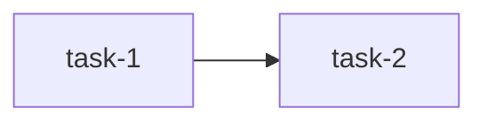

# Project Setup for AI-Agent-Driven Development

> **What:** Load this file into an AI agent when starting a new project. The agent reads this, then executes the setup to create a 3-tier context architecture that eliminates context rot and redundant loading across sessions.
>
> **How:** Give this file to your agent with: "Set up this project using the project_setup.md system. Project name is {X}, tech stack is {Y}."

---

## The Problem This Solves

When AI agents build software, they waste context window on:
- **Repeated context** -- tech stack, structure, commands repeated every session
- **Context rot** -- dozens of MD files, most irrelevant to the current task
- **Navigation chains** -- reading 6-8 files before writing a single line of code
- **Redundant instructions** -- agent behavior defined in 3+ places

This system fixes all of that with a 3-tier context architecture where an agent reads 2-3 files per session instead of 8-9.

---

## 3-Tier Context Architecture

```
Tier 0  [Always auto-loaded]     .cursor/rules/project.mdc  (~60-100 lines)
         |                        Project identity + commands + agent rules
         |
Tier 1  [overview.md first]      docs/arch/overview.md  (~20-50 lines, routes agent)
         |--- [Per-domain]        docs/arch/{domain}.md  or  docs/arch/{domain}/overview.md
         |                        Architecture per component (~100-200 lines each)
         |
Tier 2  [overview.md first]      docs/tasks/overview.md  (~15-25 lines, cross-group status)
         |--- [Per-group]         docs/tasks/{group}/overview.md  (~15-25 lines, deps + status)
         |    |--- [Per-task]     docs/tasks/{group}/{task}.md  (~30-80 lines)
         |
Tier 3  [overview.md first]      docs/ref/overview.md  (~10-15 lines, lists what's available)
         |--- [On-demand]         docs/ref/requirements.md, roadmap.md, lessons.md
```

**Per-session cost:** cursor rule (auto) + arch overview + 1 arch doc + group overview + 1 task doc = ~350 lines. No chains.

**Universal convention:** Every folder the agent might enter has an `overview.md`. The agent ALWAYS reads `overview.md` first. It either IS the content (simple section) or routes to the right sub-doc (complex section). This convention scales independently -- you can restructure any section from flat to deeply nested without changing the agent's navigation pattern.

### Tier 0: `.cursor/rules/project.mdc`

The SINGLE entry point. Auto-loaded by Cursor every session. Contains:
- Project identity (name, one-liner, tech stack table)
- Project structure (tree, 10-15 lines)
- Key commands (build, test, lint, run, deploy)
- Agent rules (plan, verify, lessons -- defined HERE, nowhere else)
- Active lessons (promoted from lessons.md when patterns recur)

**No routing table.** The cursor rule tells the agent: "read `docs/arch/overview.md` for architecture, `docs/tasks/overview.md` for tasks, `docs/ref/overview.md` for reference." The overviews handle all routing. This keeps the cursor rule stable even as the project adds domains.

### Tier 1: `docs/arch/`

Architecture docs, organized however fits the project. Always start with `docs/arch/overview.md`.

**`docs/arch/overview.md`** lists all domains and tells the agent which doc to read. It scales independently -- add rows as the project grows, no cursor rule changes needed.

**Flexible structure per domain:**

```
docs/arch/
  overview.md                   # Always read first -- routes to domain docs
  backend.md                    # Simple domain: single file
  database.md                   # Simple domain: single file
  payments/                     # Complex domain: sub-folder
    overview.md                 # Routes to sub-docs within payments
    processing.md
    billing.md
    compliance.md
  ui.md                         # Simple domain: single file
```

- **Simple domain** (e.g., `backend.md`): overview.md points to it directly. One file, 100-200 lines.
- **Complex domain** (e.g., `payments/`): overview.md points to `payments/overview.md`, which routes to sub-docs. Each sub-doc stays under 200 lines.
- **Growing domain**: When a single-file domain outgrows 200 lines, split it into a folder with its own overview.md. Only update `docs/arch/overview.md` to point to the new path -- nothing else changes.

### Tier 2: `docs/tasks/`

Task docs, grouped by domain. Always start with `docs/tasks/overview.md`.

```
docs/tasks/
  overview.md                   # Always read first -- all groups, cross-group status
  backend/
    overview.md                 # Group overview: status table + dependency graph
    graph-schema.md             # Task doc (~30-80 lines)
    repo-discovery.md
    sync-branch-aware.md
  ui/
    overview.md
    explorer-cytoscape.md
    blast-radius-highlight.md
  TEMPLATE.md                   # Copy into a group folder and rename
```

**`docs/tasks/overview.md`** lists all groups and cross-group blocking status. Agent reads this first to understand the big picture.

**`docs/tasks/{group}/overview.md`** (~15-25 lines) contains:
- A status table (task name, status, blocked by)
- A mermaid dependency graph (when tasks have non-linear dependencies)
- Cross-group dependency notes
- No prose, no architecture -- just dependency tracking

**Task docs** include a "Blocked by" field referencing prerequisite tasks by relative path.

**Navigation:** Agent reads group overview.md to find the right task, then reads the task doc. 2 levels max.

### Tier 3: `docs/ref/`

Reference material. Always start with `docs/ref/overview.md`.

**`docs/ref/overview.md`** lists what's available and when to read each file:

```
docs/ref/
  overview.md                   # What's here and when to read it
  requirements.md               # FR/NFR -- read when defining features
  roadmap.md                    # Phases, changelog -- read when planning releases
  lessons.md                    # Corrections log -- read at session start for your domain
```

The agent reads `docs/ref/overview.md` only when a task doc's Context Scope says "Read: docs/ref/..." -- not by default.

---

## Templates

### Template: `.cursor/rules/project.mdc`

```
---
description: {ProjectName} — project context, commands, and agent rules
alwaysApply: true
---

# {ProjectName}

{One-line description of what this project does.}

## Tech Stack

| Layer | Technology | Notes |
|-------|-----------|-------|
| Backend | {e.g. Rust, Node.js, Python} | {version, key libs} |
| Database | {e.g. PostgreSQL, Neo4j} | {version} |
| Frontend | {e.g. React, Vue, None} | {framework, build tool} |
| Infra | {e.g. Docker, K8s, None} | {compose, cloud} |

## Project Structure

{tree output, 10-20 lines, showing key directories only}

## Commands

| Action | Command |
|--------|---------|
| Build | `{build command}` |
| Test | `{test command}` |
| Lint | `{lint command}` |
| Run (dev) | `{dev run command}` |
| Run (prod) | `{prod run command}` |

## Navigation

Every docs folder has an `overview.md`. Always read it first -- it routes you to the right file.

- Architecture: `docs/arch/overview.md`
- Tasks: `docs/tasks/overview.md`
- Reference: `docs/ref/overview.md`

## Agent Rules

1. **overview.md first** — When entering any docs folder, read its `overview.md` before anything else. It tells you what to read next.
2. **Plan first** — For any task with 3+ steps, create a task doc in `docs/tasks/{group}/` before coding. Re-plan if blocked.
3. **Check dependencies** — Before starting a task, read its "Blocked by" field. If prerequisites are not Done, do not start. Read the group overview.md for the dependency graph.
4. **Verify before done** — Run the verification command in the task doc. Never mark complete without proof.
5. **Update status** — After completing a task, mark it Done in both the task doc and the group overview.md. Check if this unblocks other tasks.
6. **Context scope** — Read ONLY what the task doc's "Context Scope" section says. Do not read unrelated docs.
7. **Use task tools** — Check the task doc's "Tools & Environment" section. Use the specified MCP servers, CLI tools, agent types, browser, scripts, and env vars. Prefer MCP tools over raw shell commands when an MCP server is listed.
8. **After corrections** — Add to `docs/ref/lessons.md`. If the pattern recurs, promote it to a rule here.
9. **Architecture changes** — If the task changes design/modules/API/data flow, update the relevant `docs/arch/` file and its overview.md if the structure changed.
10. **Subagents** — One task per subagent. Use the agent type from "Tools & Environment" if specified.
11. **Simplicity** — Minimal changes. Find root causes. No temporary hacks.

## Active Lessons

(Promoted from docs/ref/lessons.md when patterns recur. Add entries here so they are auto-loaded.)

```

### Template: `docs/arch/overview.md` (architecture entry point)

```markdown
# Architecture Overview

> Always read this first when you need architecture context.
> It routes you to the right domain doc.

| Domain | Doc | Structure | Description |
|--------|-----|-----------|-------------|
| Backend | [backend.md](backend.md) | Single file | REST API, MCP server, sync engine |
| Database | [database.md](database.md) | Single file | Graph schema, Neo4j, Cypher |
| Payments | [payments/overview.md](payments/overview.md) | Sub-folder | Processing, billing, compliance |
| UI | [ui.md](ui.md) | Single file | React app, graph visualization |
| Deployment | [deployment.md](deployment.md) | Single file | Docker, CI/CD |

When a domain outgrows a single file, split it into a folder with its own overview.md.
Update this table when adding or restructuring domains.
```

### Template: `docs/tasks/overview.md` (top-level task overview)

```markdown
# Tasks Overview

> Always read this first when working on tasks.
> Shows all groups and cross-group blocking status.

| Group | Status | Blocked by | Description |
|-------|--------|-----------|-------------|
| [backend/](backend/) | In progress | -- | API, sync, MCP tools |
| [ui/](ui/) | Blocked | backend/ | Graph visualization |
| [deployment/](deployment/) | Not started | backend/ | Docker, CI/CD |
```

### Template: `docs/tasks/{group}/overview.md` (group task overview)

```markdown
# {Group Name} Tasks

| Task | File | Status | Blocked by |
|------|------|--------|-----------|
| {Task 1 name} | [task-1.md](task-1.md) | Done | -- |
| {Task 2 name} | [task-2.md](task-2.md) | In progress | task-1 |
| {Task 3 name} | [task-3.md](task-3.md) | Blocked | task-1, task-2 |

{dependency graph -- include only when tasks have non-linear dependencies}

` ``mermaid
flowchart LR
  T1[task-1] --> T2[task-2]
  T1 --> T3[task-3]
  T2 --> T3
` ``

Cross-group dependencies:
- task-3 requires [../ui/explorer.md](../ui/explorer.md) (optional)
```

**Note:** Keep group overview.md under 25 lines. Status table + optional mermaid graph. No prose.

### Template: `docs/ref/overview.md` (reference entry point)

```markdown
# Reference Overview

> Read this only when a task doc's Context Scope says "Read: docs/ref/..."
> Not read by default.

| Doc | When to read |
|-----|-------------|
| [requirements.md](requirements.md) | Defining new features, validating scope |
| [roadmap.md](roadmap.md) | Planning releases, checking milestones |
| [lessons.md](lessons.md) | After corrections, or at session start for your domain |
```

### Template: `docs/tasks/TEMPLATE.md` (task doc)

```markdown
# {Task Name}

**Status:** Not started | In progress | Done
**Blocked by:** {task name with relative path, or "none"}
**Group:** {group folder name}

## Context Scope

Read: {docs/arch/backend.md, specific file paths, or section references}
Ignore: {everything else, or specific areas to skip}

## Tools & Environment

> Include only the lines relevant to this task. Delete unused lines.

- **MCP servers:** {server names this task needs, e.g. firebase, dart, neo4j -- or "none"}
- **CLI tools:** {commands the agent should use, e.g. cargo test, npm run build, docker compose up}
- **Agent type:** {subagent type for execution, e.g. shell, browser-use, generalPurpose -- or "default"}
- **Browser:** {Yes -- URL to verify, e.g. http://localhost:3001 | No}
- **Scripts:** {project-specific scripts to use, e.g. ./restart.sh, ./scripts/seed-db.sh -- or "none"}
- **Env vars:** {required environment variables, e.g. NEO4J_URI=bolt://localhost:7687 -- or "none"}

## What / Why

{3-5 lines: what this task does, why it exists, what is in/out of scope.}

## Steps

1. [ ] {Step title}
   - {What to do}
   - Verify: `{command}`
   - Expected: {what success looks like}

2. [ ] {Step title}
   - {What to do}
   - Verify: `{command}`
   - Expected: {what success looks like}

{Add more steps as needed. For complex tasks, group into phases.}

## Notes

- Arch impact: {docs/arch/X.md, or "none"}
- Estimated effort: {small / medium / large}
```

**Tools & Environment usage guide:**

| Field | When to include | Example |
|-------|----------------|---------|
| **MCP servers** | Task interacts with external services via MCP | `firebase` for deploy, `dart` for Flutter analysis |
| **CLI tools** | Task needs specific build/test/deploy commands | `cargo test graph`, `psql -d mydb` |
| **Agent type** | Task needs a specific subagent | `shell` for build-heavy, `browser-use` for UI testing |
| **Browser** | Task requires visual verification or UI interaction | `Yes -- http://localhost:8080/settings` |
| **Scripts** | Task uses project-specific automation | `./scripts/migrate.sh`, `./restart.sh` |
| **Env vars** | Task needs specific environment configuration | `DATABASE_URL=...`, `API_KEY=...` |

Most tasks will only need 1-2 of these fields. Delete the rest to keep the doc lean.

### Template: `docs/ref/lessons.md`

```markdown
# Lessons Learned

> Corrections log. After any user correction, add an entry below.
> When a pattern recurs (2+ times), promote it to an Active Lesson
> in `.cursor/rules/project.mdc` so it is auto-loaded every session.

## Lessons

| Date | What happened | Rule | Promoted? |
|------|--------------|------|-----------|
| | | | |
```

### Template: `docs/arch/TEMPLATE.md`

```markdown
# {Domain Name} Architecture

> Read this when working on {domain} tasks. See `.cursor/rules/project.mdc`
> for project overview and commands.

## Overview

{2-3 sentences: what this component does, its boundaries.}

## Design Decisions

- {Decision 1: what was chosen and why}
- {Decision 2: ...}

## Key Modules / Files

| Module | Path | Responsibility |
|--------|------|---------------|
| | | |

## Data Flow

{Describe or diagram the key data flows for this domain.
Use mermaid if helpful, plain text if simple.}

## API Surface (if applicable)

{Endpoints, tool interfaces, or public APIs this domain exposes.}
```

---

## Setup Script

The following script creates the folder structure and template files for a new project. Run it from the project root.

```bash
#!/usr/bin/env bash
set -euo pipefail

# ──────────────────────────────────────────────
# AI-Agent Project Setup Script
# Run from the project root directory.
# Usage: bash project_setup.sh
# ──────────────────────────────────────────────

echo "Setting up AI-agent project structure..."

# Create directories
mkdir -p .cursor/rules
mkdir -p docs/arch
mkdir -p docs/tasks
mkdir -p docs/ref

# ── docs/arch/overview.md ──
if [ ! -f docs/arch/overview.md ]; then
cat > docs/arch/overview.md << 'AOVW_EOF'
# Architecture Overview

> Always read this first when you need architecture context.
> It routes you to the right domain doc.

| Domain | Doc | Structure | Description |
|--------|-----|-----------|-------------|

When a domain outgrows a single file, split it into a folder with its own overview.md.
Update this table when adding or restructuring domains.
AOVW_EOF
echo "  Created docs/arch/overview.md"
else
echo "  Skipped docs/arch/overview.md (already exists)"
fi

# ── docs/tasks/overview.md (top-level task overview) ──
if [ ! -f docs/tasks/overview.md ]; then
cat > docs/tasks/overview.md << 'TOVW_EOF'
# Tasks Overview

> Always read this first when working on tasks.
> Shows all groups and cross-group blocking status.

| Group | Status | Blocked by | Description |
|-------|--------|-----------|-------------|
TOVW_EOF
echo "  Created docs/tasks/overview.md"
else
echo "  Skipped docs/tasks/overview.md (already exists)"
fi

# ── docs/ref/overview.md ──
if [ ! -f docs/ref/overview.md ]; then
cat > docs/ref/overview.md << 'ROVW_EOF'
# Reference Overview

> Read this only when a task doc's Context Scope says "Read: docs/ref/..."

| Doc | When to read |
|-----|-------------|
| [requirements.md](requirements.md) | Defining new features, validating scope |
| [roadmap.md](roadmap.md) | Planning releases, checking milestones |
| [lessons.md](lessons.md) | After corrections, or at session start for your domain |
ROVW_EOF
echo "  Created docs/ref/overview.md"
else
echo "  Skipped docs/ref/overview.md (already exists)"
fi

# ── .cursor/rules/project.mdc ──
if [ ! -f .cursor/rules/project.mdc ]; then
cat > .cursor/rules/project.mdc << 'RULE_EOF'
---
description: ProjectName — project context, commands, and agent rules
alwaysApply: true
---

# ProjectName

TODO: One-line description of what this project does.

## Tech Stack

| Layer | Technology | Notes |
|-------|-----------|-------|
| Backend | TODO | |
| Database | TODO | |
| Frontend | TODO | |
| Infra | TODO | |

## Project Structure

TODO: paste `tree -L 2 -I node_modules` output here.

## Commands

| Action | Command |
|--------|---------|
| Build | `TODO` |
| Test | `TODO` |
| Lint | `TODO` |
| Run (dev) | `TODO` |

## Navigation

Every docs folder has an overview.md. Always read it first.

- Architecture: docs/arch/overview.md
- Tasks: docs/tasks/overview.md
- Reference: docs/ref/overview.md

## Agent Rules

1. **overview.md first** — When entering any docs folder, read its overview.md before anything else.
2. **Plan first** — For any task with 3+ steps, create a task doc in docs/tasks/{group}/ before coding.
3. **Check dependencies** — Before starting a task, read its "Blocked by" field and the group overview.md.
4. **Verify before done** — Run the verification command in the task doc. Never mark complete without proof.
5. **Update status** — After completing a task, mark Done in both task doc and group overview.md.
6. **Context scope** — Read ONLY what the task doc's "Context Scope" section says.
7. **Use task tools** — Check the task doc's "Tools & Environment" section. Prefer MCP over shell.
8. **After corrections** — Add to docs/ref/lessons.md. If the pattern recurs, promote it here.
9. **Architecture changes** — Update the relevant docs/arch/ file and its overview.md if structure changed.
10. **Subagents** — One task per subagent. Use the agent type from "Tools & Environment" if specified.
11. **Simplicity** — Minimal changes. Find root causes. No temporary hacks.

## Active Lessons

(None yet. Promote from docs/ref/lessons.md when patterns recur.)

RULE_EOF
echo "  Created .cursor/rules/project.mdc"
else
echo "  Skipped .cursor/rules/project.mdc (already exists)"
fi

# ── docs/tasks/TEMPLATE.md ──
if [ ! -f docs/tasks/TEMPLATE.md ]; then
cat > docs/tasks/TEMPLATE.md << 'TASK_EOF'
# {Task Name}

**Status:** Not started
**Blocked by:** {relative path to prerequisite task, or "none"}
**Group:** {group folder name}

## Context Scope

Read: {docs/arch/backend.md, specific file paths, or section references}
Ignore: {everything else, or specific areas to skip}

## Tools & Environment

> Include only the lines relevant to this task. Delete unused lines.

- **MCP servers:** {e.g. firebase, dart, neo4j -- or "none"}
- **CLI tools:** {e.g. cargo test, npm run build, docker compose up}
- **Agent type:** {e.g. shell, browser-use, generalPurpose -- or "default"}
- **Browser:** {Yes -- URL to verify | No}
- **Scripts:** {e.g. ./restart.sh -- or "none"}
- **Env vars:** {e.g. NEO4J_URI=bolt://localhost:7687 -- or "none"}

## What / Why

{3-5 lines: what this task does, why it exists, what is in/out of scope.}

## Steps

1. [ ] {Step title}
   - {What to do}
   - Verify: `{command}`
   - Expected: {what success looks like}

2. [ ] {Step title}
   - {What to do}
   - Verify: `{command}`
   - Expected: {what success looks like}

## Notes

- Arch impact: {docs/arch/X.md, or "none"}
- Estimated effort: {small / medium / large}
TASK_EOF
echo "  Created docs/tasks/TEMPLATE.md"
else
echo "  Skipped docs/tasks/TEMPLATE.md (already exists)"
fi

# ── docs/tasks/GROUP_OVERVIEW_TEMPLATE.md ──
if [ ! -f docs/tasks/GROUP_OVERVIEW_TEMPLATE.md ]; then
cat > docs/tasks/GROUP_OVERVIEW_TEMPLATE.md << 'GOVW_EOF'
# {Group Name} Tasks

| Task | File | Status | Blocked by |
|------|------|--------|-----------|
| {Task 1} | [task-1.md](task-1.md) | Not started | -- |
| {Task 2} | [task-2.md](task-2.md) | Not started | task-1 |



Cross-group dependencies: none
GOVW_EOF
echo "  Created docs/tasks/GROUP_OVERVIEW_TEMPLATE.md"
else
echo "  Skipped docs/tasks/GROUP_OVERVIEW_TEMPLATE.md (already exists)"
fi

# ── docs/arch/TEMPLATE.md ──
if [ ! -f docs/arch/TEMPLATE.md ]; then
cat > docs/arch/TEMPLATE.md << 'ARCH_EOF'
# {Domain Name} Architecture

> Read this when working on {domain} tasks. See `.cursor/rules/project.mdc`
> for project overview and commands.

## Overview

{2-3 sentences: what this component does, its boundaries.}

## Design Decisions

- {Decision 1: what was chosen and why}
- {Decision 2: ...}

## Key Modules / Files

| Module | Path | Responsibility |
|--------|------|---------------|
| | | |

## Data Flow

{Describe or diagram the key data flows for this domain.}

## API Surface

{Endpoints, tool interfaces, or public APIs this domain exposes.}
ARCH_EOF
echo "  Created docs/arch/TEMPLATE.md"
else
echo "  Skipped docs/arch/TEMPLATE.md (already exists)"
fi

# ── docs/ref/lessons.md ──
if [ ! -f docs/ref/lessons.md ]; then
cat > docs/ref/lessons.md << 'LESSONS_EOF'
# Lessons Learned

> Corrections log. After any user correction, add an entry below.
> When a pattern recurs (2+ times), promote it to an Active Lesson
> in `.cursor/rules/project.mdc` so it is auto-loaded every session.

## Lessons

| Date | What happened | Rule | Promoted? |
|------|--------------|------|-----------|
| | | | |
LESSONS_EOF
echo "  Created docs/ref/lessons.md"
else
echo "  Skipped docs/ref/lessons.md (already exists)"
fi

# ── docs/ref/requirements.md ──
if [ ! -f docs/ref/requirements.md ]; then
cat > docs/ref/requirements.md << 'REQ_EOF'
# Requirements

> Functional and non-functional requirements. Read when defining new features
> or validating scope. Not auto-loaded — referenced from task docs when needed.

## Functional Requirements

| ID | Requirement | Description |
|----|-------------|-------------|
| FR-1 | TODO | |

## Non-Functional Requirements

| ID | Category | Requirement | Notes |
|----|----------|-------------|-------|
| NFR-1 | Performance | TODO | |
REQ_EOF
echo "  Created docs/ref/requirements.md"
else
echo "  Skipped docs/ref/requirements.md (already exists)"
fi

# ── docs/ref/roadmap.md ──
if [ ! -f docs/ref/roadmap.md ]; then
cat > docs/ref/roadmap.md << 'ROAD_EOF'
# Roadmap

> Development phases and changelog. Not auto-loaded — read when planning
> releases or reviewing project history.

## Phases

| Phase | Status | Description |
|-------|--------|-------------|
| 1 | In progress | TODO |

## Changelog

| Date | Version | Changes |
|------|---------|---------|
| | 0.1.0 | Initial setup |
ROAD_EOF
echo "  Created docs/ref/roadmap.md"
else
echo "  Skipped docs/ref/roadmap.md (already exists)"
fi

echo ""
echo "Done. Next steps:"
echo "  1. Fill in .cursor/rules/project.mdc with your project's tech stack, structure, and commands"
echo "  2. Create docs/arch/{domain}.md files and add rows to docs/arch/overview.md"
echo "  3. When work begins, create task group folders: mkdir docs/tasks/{group}/"
echo "     Copy GROUP_OVERVIEW_TEMPLATE.md -> docs/tasks/{group}/overview.md"
echo "     Copy TEMPLATE.md -> docs/tasks/{group}/{task-name}.md"
echo "     Add a row to docs/tasks/overview.md for the group"
echo ""
echo "Convention: every folder has an overview.md -- agent always reads it first."
echo "Per-session cost: ~350 lines (cursor rule + arch overview + domain doc + group overview + task doc)"
```

---

## Agent Instructions: How to Use This on a New Project

When a user says "Set up this project using project_setup.md":

1. **Run the setup script** (or create files manually if no shell access):
   - Creates `.cursor/rules/project.mdc`, all `overview.md` files, templates, and `docs/ref/` files

2. **Fill in `project.mdc`** with the user's project details:
   - Project name and description
   - Tech stack (ask the user if not obvious from the codebase)
   - Run `tree -L 2` or inspect the repo to fill project structure
   - Determine build/test/lint/run commands from package.json, Cargo.toml, Makefile, etc.

3. **Create initial arch docs** and update `docs/arch/overview.md`:
   - One `docs/arch/{domain}.md` per major component (backend, frontend, database, etc.)
   - Use the arch template; fill from existing code, README, or user input
   - Keep each under 200 lines
   - Add a row to `docs/arch/overview.md` for each domain doc created
   - When a domain outgrows 200 lines, split into `docs/arch/{domain}/overview.md` + sub-docs

4. **Create task groups when work begins:**
   - Create `docs/tasks/{group}/` subfolder for each domain (e.g., `backend/`, `ui/`)
   - Copy `GROUP_OVERVIEW_TEMPLATE.md` -> `docs/tasks/{group}/overview.md`
   - Copy `TEMPLATE.md` -> `docs/tasks/{group}/{task-name}.md` per task
   - Add a row to `docs/tasks/overview.md` for the new group

5. **Managing task dependencies:**
   - **Within a group:** Use task file names in the "Blocked by" field (e.g., `graph-schema.md`)
   - **Cross-group:** Use relative paths (e.g., `../backend/sync-branch.md`)
   - **Group overview.md** must reflect current status and dependency graph
   - **Top-level overview.md** must reflect cross-group blocking status
   - Before starting a task, check its "Blocked by" -- if the prerequisite's status is not Done, do not start
   - After completing a task, update its status in both the task doc and the group overview.md

6. **Scaling a section:**
   - When any `overview.md` gets too long (>30 lines), split its content into sub-files and keep the overview as a thin router
   - When a single-file arch doc exceeds 200 lines, convert to a folder: `backend.md` -> `backend/overview.md` + sub-docs
   - Update the parent overview.md to point to the new path -- nothing else changes

7. **Clean up if migrating from an existing system:**
   - If there are existing architecture/workflow docs, consolidate into the new structure
   - Remove redundant docs (agent guides, task workflows that duplicate cursor rules)
   - Flatten any plan/task hierarchies into `docs/tasks/{group}/`
   - Preserve dependency information from old plan READMEs into new group overview.md files

8. **Verify the setup:**
   - Confirm `.cursor/rules/project.mdc` exists and has `alwaysApply: true`
   - Confirm `docs/arch/overview.md` exists and lists at least one domain
   - Confirm `docs/tasks/overview.md` exists
   - Confirm `docs/tasks/TEMPLATE.md` exists
   - Confirm `docs/ref/overview.md` exists
   - Confirm `docs/ref/lessons.md` exists

---

## Enterprise Scaling Patterns

These patterns are not needed for small projects. Apply them when the project hits the threshold described in each section.

### 1. Task Archive (threshold: 15+ tasks in a group)

When a group's overview.md lists more than ~15 tasks, completed tasks become noise. The agent reads 15 "Done" rows to find the 3 active ones.

**Solution:** Move completed tasks to an `archive/` subfolder within the group.

```
docs/tasks/backend/
  overview.md                   # Only active + blocked tasks
  sync-branch.md                # In progress
  search-tool.md                # Blocked
  archive/
    overview.md                 # Historical log of completed tasks
    graph-schema.md             # Done
    repo-discovery.md           # Done
    scoping-repo-branch.md      # Done
```

**Rules:**
- When a task is marked Done, move it to `archive/` and remove its row from the group overview.md
- Add a row to `archive/overview.md` (date completed, brief result)
- The group overview.md stays lean: only active, blocked, and not-started tasks
- Archive is never read during normal work -- only for historical reference

### 2. Cross-Cutting Task Group (threshold: tasks spanning 3+ domains)

Enterprise monoliths have tasks that don't belong to any single domain: "add audit logging everywhere", "migrate to gRPC", "upgrade auth library across all services."

**Solution:** Create a `cross-cutting/` task group.

```
docs/tasks/
  overview.md
  cross-cutting/
    overview.md                 # Status + affected domains per task
    audit-logging.md            # Touches: auth, payments, orders, notifications
    grpc-migration.md           # Touches: all backend services
  backend/
    overview.md
    ...
```

**Cross-cutting task doc additions:**

```markdown
# Audit Logging

**Status:** In progress
**Blocked by:** none
**Group:** cross-cutting
**Affected domains:** auth, payments, orders, notifications

## Context Scope

Read: docs/arch/overview.md (to find all affected domain docs)
Read: docs/arch/backend.md (logging infrastructure)
```

**Rules:**
- Cross-cutting tasks list all affected domains in an "Affected domains" field
- Agent reads `docs/arch/overview.md` to find the arch docs for each affected domain
- If a cross-cutting task blocks domain tasks, those domain tasks reference it: `Blocked by: ../cross-cutting/audit-logging.md`
- Cross-cutting group is listed first in `docs/tasks/overview.md`

### 3. Domain-Scoped Lessons (threshold: 15+ lessons or 10+ domains)

When lessons accumulate, the "Active Lessons" section in `project.mdc` grows until it dominates the cursor rule. 20 lessons = 40-60 lines of rules, most irrelevant to the current task domain.

**Solution:** Use Cursor's glob-scoped rules to load lessons only for the domain the agent is working in.

```
.cursor/rules/
  project.mdc                           # alwaysApply: true -- universal rules + 3-5 universal lessons
  lessons-backend.mdc                   # globs: ["services/backend/**", "src/api/**"]
  lessons-payments.mdc                  # globs: ["services/payments/**"]
  lessons-ui.mdc                        # globs: ["graph-ui/**", "frontend/**"]
```

**Each domain lesson rule:**

```
---
description: Lessons for {domain} -- auto-loaded when editing {domain} files
globs: ["{path-pattern}/**"]
---

# {Domain} Lessons

- {Lesson from correction on 2026-03-10: ...}
- {Lesson from correction on 2026-03-15: ...}
```

**Rules:**
- `project.mdc` keeps only 3-5 universal lessons (apply to ALL domains)
- Domain-specific lessons go in domain `.mdc` files with `globs:` matching that domain's file paths
- When promoting from `docs/ref/lessons.md`: if it's universal, add to `project.mdc`; if domain-specific, add to `lessons-{domain}.mdc`
- Cursor auto-loads the right lessons when the agent touches files in that glob

**Migration:** Start with all lessons in `project.mdc`. When you hit ~10 lessons, split domain-specific ones into glob-scoped rules.

### 4. Concurrent Agent Branching (threshold: 2+ agents working simultaneously)

When multiple agents work on different tasks in the same repo, they can create conflicting changes to overview.md files, mark tasks done that block each other, or introduce merge conflicts.

**Solution:** Each agent works on a git branch. Status updates are coordinated through branch + PR workflow.

**Branch convention:**

```
main                          # Source of truth for all overview.md files
task/backend-sync-branch      # Agent A working on sync-branch task
task/ui-explorer              # Agent B working on explorer task
task/cross-cutting-audit      # Agent C working on audit logging
```

**Rules:**
- Each agent creates a branch named `task/{group}-{task-name}` before starting work
- Agents update their own task doc's status on their branch
- Agents do NOT update group overview.md or top-level overview.md on their branch
- When work is done, create a PR. The PR description includes status changes for overview.md files
- Overview.md status updates happen on merge to `main` (by the merging agent or human)
- Before starting work, agent pulls `main` and reads overview.md files to check current status

**Task doc addition for concurrent work:**

```markdown
**Branch:** task/backend-sync-branch
```

**Why this works:** Overview.md files are the coordination layer. By updating them only on `main` (via PR merge), concurrent agents never conflict on status tracking. Each agent's actual code changes are isolated on their own branch.

### Scaling Checklist

Use this to decide which patterns to activate:

| Signal | Pattern to activate |
|--------|-------------------|
| A task group has 15+ tasks (most Done) | Task Archive (#1) |
| A task touches 3+ domains | Cross-Cutting Group (#2) |
| 10+ lessons in project.mdc Active Lessons | Domain-Scoped Lessons (#3) |
| 2+ agents assigned to different tasks simultaneously | Concurrent Agent Branching (#4) |
| An arch doc exceeds 200 lines | Split into `{domain}/overview.md` + sub-docs (already in base system) |
| A group overview.md exceeds 30 lines | Archive completed tasks (#1) or split the group |

None of these require restructuring the base system. They are additive -- activate when you hit the threshold, ignore until then.

---

## Design Principles (Why This Works)

1. **overview.md everywhere** — Every folder has an `overview.md`. Agent always reads it first. It either IS the content or routes to sub-docs. This one convention handles simple projects and enterprise monoliths with the same navigation pattern.
2. **Scales independently** — Any section can grow from a single file to a deep folder tree. Only the parent overview.md changes. The cursor rule, agent rules, and navigation pattern stay the same.
3. **Single entry point** — The cursor rule IS the project context. It points to three overview.md files. No chain of docs, no routing table that grows with the project.
4. **Context scoping** — Each task doc says "Read X. Ignore Y." at the top.
5. **Light grouping** — Tasks grouped by domain (2 levels max). Each group has a tiny overview.md with status + dependency graph.
6. **Dependency tracking** — Group overview.md has a mermaid graph for within-group ordering. Top-level overview.md shows cross-group blocking. Task docs have "Blocked by" for explicit prerequisites.
7. **Verification embedded** — Each task step has its own verify command. No separate acceptance file.
8. **Lessons that enforce** — Recurring lessons become cursor rules (auto-loaded), not a file the agent might skip.
9. **Grow organically** — Start with project.mdc and 1 arch doc. Add domains, groups, and sub-docs as the project grows. No upfront ceremony, no structural rewrites.
